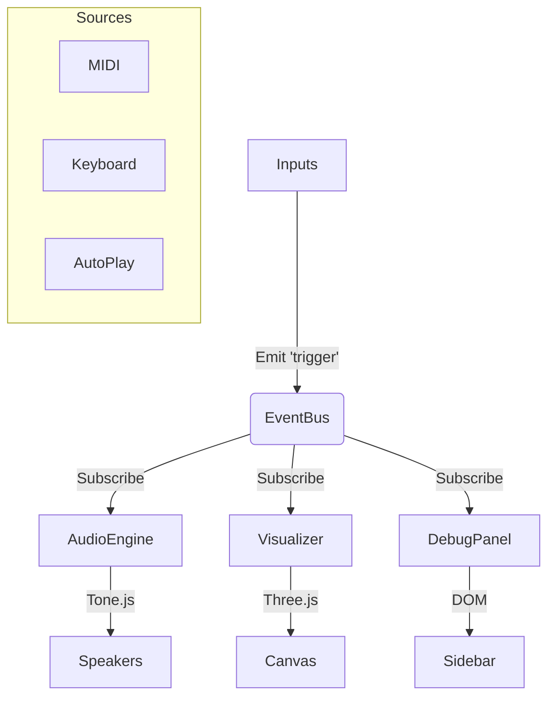

# Seilnetz V2: The Sonic Web

## 🕸️ Overview
Seilnetz V2 is a sound-reactive 3D visualization of a net structure. It serves as the software counterpart to the physical installation, translating MIDI signals from the net into immersive audio and visual feedback.

## 🚀 Quick Start
1. **Open:** Drag `index.html` into Google Chrome.
2. **Start:** Click the overlay to initialize the Audio Engine.
3. **Play:**
   - Press keys `1`-`6` on your keyboard.
   - Click "Toggle Auto-Play" for a demo.
   - Connect your ESP32 via Bluetooth MIDI.

---

## 🎹 Features

### 1. Audio Engine (Tone.js)
- **Polyphonic Synthesis:** 6-voice sine wave synth with slow attack ADSR.
- **Reverb Wash:** Integrated reverb for atmospheric depth.
- **Scales:** Selectable musical scales (Safe C9, Pentatonic, Whole Tone, Hirajoshi).

### 2. Visualization (Three.js)
- **3D Net:** 6 nodes arranged in 3D space connected by lines.
- **Reactive Animation:**
  - **Punch:** Nodes scale up on trigger.
  - **Glow:** Emissive material pulses based on velocity.
  - **Drift:** Entire net floats gently in idle state.

### 3. Inputs
- **MIDI:** Auto-detects connected MIDI devices.
- **Keyboard:** Maps number keys 1-6 to sensors 0-5.
- **Auto-Play:** Generates organic random patterns for testing.

---

## 🛠️ Architecture
Single-file architecture (`index.html`) for maximum portability.

### Configuration
All parameters are tunable in the `CONFIG` object at the top of the script:
- **Scales:** Add new arrays of MIDI note numbers.
- **Colors:** Hex codes for the nodes.
- **Node Positions:** x, y, z coordinates.
- **Audio:** ADSR envelope and Reverb settings.

---

## 🔌 Hardware Integration
The system listens for MIDI Note On messages (status 144).
- **Note Number:** Interpreted as sensor index (0-5).
  - *Fallback:* If note > 12, it tries to map musical notes back to index.
- **Velocity:** Maps to volume and visual brightness (1-127).

**Bluetooth MIDI (ESP32):**
Ensure your ESP32 device advertises as a BLE MIDI service. Chrome on Mac/Android supports this natively. On Windows, you may need a bridge.

---

## 📜 Legacy
Previous Python and SuperCollider experiments have been archived in the `legacy/` folder (if applicable, or removed to keep the project clean).

